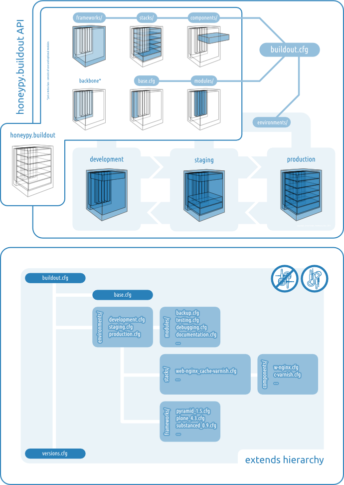
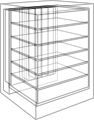
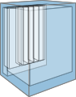
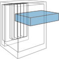
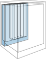
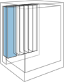
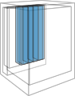

=============================
honeypy.buildout API
=============================

[TODO] Lorem ipsum si dolor amet consecetur...

   The Big Picture. [#f1]_

------------------------------
Application
------------------------------

At the end of the day, all you want to do is to write useful and good looking applications. Normally you should not care to much about all the nuts and bolts between developing your application code and its secure and performant deliverance out of your notebook up to the internet. Your app and your domain should be sufficient to bring it up.

The main app.cfg file
===============================

.. toctree::
   :maxdepth: 2

   app.cfg

------------------------------
Environments
------------------------------

Hosting environments for the different scenarios in the software development and deployment process.

Available Environments
===============================

.. toctree::
   :maxdepth: 2

   environments

------------------------------
Frameworks
------------------------------

Python application and web-application frameworks.

Available Frameworks
===============================

.. toctree::
   :maxdepth: 2

   frameworks

Anatomy
===============================

[TODO] Lorem ipsum si dolor amet consecetur...

.. literalinclude:: ../buildout/frameworks/substanced.cfg
   :language: ini

------------------------------
Stacks
------------------------------

.. image:: images/stack.png

A stack is a combination of a framework and several components to bring the framework online.

Available Stacks
===============================

* plone4.3_database-zodb.cfg
* plone4.3_database-zodb_cache-varnish_webserver-apache.cfg
* plone4.3_database-zeo_loadbalancer-nginx_cache-varnish_webserver-nginx.cfg
* ...

Anatomy
===============================

[TODO] Lorem ipsum si dolor amet consecetur...

------------------------------
Components 
------------------------------

Server components like web server, proxies, databases, load balancers, caches etc., giving additional performance 

Available Components
===============================

* cache-varnish.cfg
* database-mysql.cfg
* database-postgres.cfg
* database-zeo.cfg
* database-zodb.cfg
* loadbalancer-ngix.cfg
* webserver-apache.cfg
* webserver-nginx.cfg
* ...

Anatomy
===============================

[TODO] Lorem ipsum si dolor amet consecetur...

------------------------------
Backbone 
------------------------------

Core 
==============================

Cross-sectional functions which are used in every configuration. These config files are vital for the functionality of honeypy.buildout and must be included in every honeypy.buildout environment.cfg. 

Core Modules
------------------------------

* base.cfg
* dependencies.cfg
* directories.cfg
* egginstaller.cfg

base.cfg
------------------------------

[TODO] Lorem ipsum si dolor amet consecetur...

.. literalinclude:: ../buildout/core/base.cfg
   :language: ini

dependencies.cfg
------------------------------

[TODO] Lorem ipsum si dolor amet consecetur...

.. literalinclude:: ../buildout/core/dependencies.cfg
   :language: ini

directories.cfg
------------------------------

[TODO] Lorem ipsum si dolor amet consecetur...

.. literalinclude:: ../buildout/core/directories.cfg
   :language: ini

egginstaller.cfg
------------------------------

[TODO] Lorem ipsum si dolor amet consecetur...

.. literalinclude:: ../buildout/core/egginstaller.cfg
   :language: ini

Modules 
==============================

Optional cross-sectional functions which are used in some configurations.

Optional Modules
------------------------------

* debugging
* documentation
* testing
* ...

Anatomy
------------------------------

[TODO] Lorem ipsum si dolor amet consecetur...

.. literalinclude:: ../buildout/modules/documentation.cfg
   :language: ini

.. rubric:: Footnotes

.. [#f1] The left image was taken by `Kazuhisa OTSUBO. <http://www.flickr.com/people/82175587@N00>`_ the right by `Justin De La Ornellas  <http://www.flickr.com/people/85297901@N00>`_ Both are licensed under `CC BY 2.0. <http://creativecommons.org/licenses/by/2.0/deed.de>`_ and remixed by Arno Rinker.