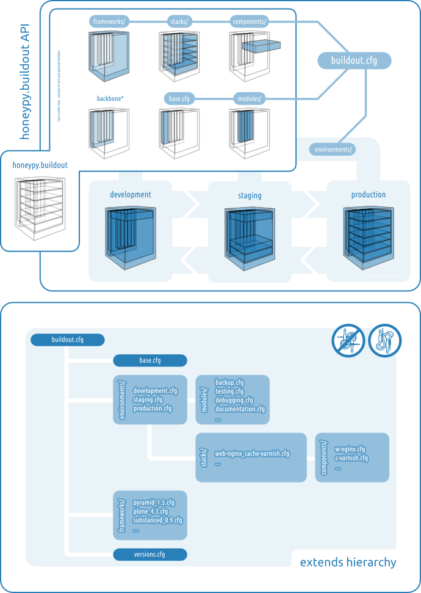

=============================
honeypy.buildout API
=============================

   But I'm just a soul whose intentions are good:
   Oh Lord! Please don't let me be misunderstood! [#f1]_

------------------------------
app.cfg 
------------------------------

[TODO] Lorem ipsum si dolor amet consecetur...

------------------------------
Environments
------------------------------

.. image:: images/buildout.png

Hosting environments for the different scenarios in the software development and deployment process.

Anatomy
===============================

[TODO] Lorem ipsum si dolor amet consecetur...

Available Environments
===============================

* development.cfg
* staging.cfg
* production.cfg

------------------------------
Frameworks
------------------------------

Python application and web-application frameworks.

Anatomy
===============================

[TODO] Lorem ipsum si dolor amet consecetur...

Available Frameworks
===============================

* zope.cfg
* plone.cfg
* pyramid.cfg
* ...

------------------------------
Stacks
------------------------------

.. image:: images/stack.png

A stack is a combination of a framework and several components to bring the framework online.

Anatomy
===============================

[TODO] Lorem ipsum si dolor amet consecetur...

Available Stacks
===============================

* plone4.3_database-zodb.cfg
* plone4.3_database-zodb_cache-varnish_webserver-apache.cfg
* plone4.3_database-zeo_loadbalancer-nginx_cache-varnish_webserver-nginx.cfg
* ...

------------------------------
Components 
------------------------------

.. image:: images/component.png

Server components like web server, proxies, databases, load balancers, caches etc., giving additional performance 

Anatomy
===============================

[TODO] Lorem ipsum si dolor amet consecetur...

Available Components
===============================

* cache-varnish.cfg
* database-mysql.cfg
* database-postgres.cfg
* database-zeo.cfg
* database-zodb.cfg
* loadbalancer-ngix.cfg
* webserver-apache.cfg
* webserver-nginx.cfg
* ...

------------------------------
Backbone 
------------------------------

.. image:: images/backbone.png

Core 
==============================

.. image:: images/core.png

Cross-sectional functions which are used in every configuration. These config files are vital for the functionality of honeypy.buildout and must be included in every honeypy.buildout environment.cfg. 

Anatomy
------------------------------

[TODO] Lorem ipsum si dolor amet consecetur...

Core Modules
------------------------------

* base.cfg
* dependencies.cfg
* directories.cfg
* egginstaller.cfg

Modules 
==============================

Optional cross-sectional functions which are used in some configurations.

Anatomy
------------------------------

[TODO] Lorem ipsum si dolor amet consecetur...

Optional Modules
------------------------------

* debugging
* documentation
* testing
* ...

.. rubric:: Footnotes

.. [#f1] The left image was taken by `Kazuhisa OTSUBO. <http://www.flickr.com/people/82175587@N00>`_ the right by `Justin De La Ornellas  <http://www.flickr.com/people/85297901@N00>`_ Both are licensed under `CC BY 2.0. <http://creativecommons.org/licenses/by/2.0/deed.de>`_ and remixed by Arno Rinker.